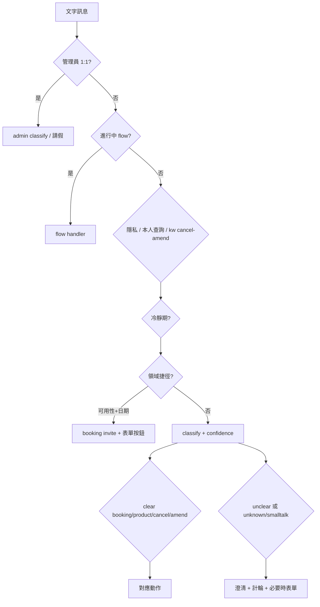

# 意圖理解通用指導原則（Intent Understanding Guide）

> **適用**：所有 `line-bot-custom-service` 新案 Phase 3 起必讀。  
> **來源**：花園漫步（Garden Stroll）專案 2026-08 意圖優化實戰；已抽象為產業無關原則。  
> **目的**：新案**第一天**就具備分層路由、明確度閘門、對話脈絡與高風險語意偵測，避免事後長期補洞。

---

## 1. 核心命題

LINE Bot 客服的成敗，不在「能回話」，而在 **充分理解客人意圖後，採取正確的下一步**：

| 錯誤 | 後果 |
|---|---|
| 「取消預約」→ 開新預約表單 | 客人 frustration、流程死結 |
| 「剪髮多少錢」→ 管理員銷量報表 | 隱私／角色混淆 |
| 「明天有空嗎」→ FAQ 答錯星期 | 信任崩潰 |
| 只有「明天」→ 直接開表單 | 過早行動、體驗粗糙 |
| 澄清無限輪 | 資源浪費、其他客人無法服務 |

**原則**：聊天室只做 **理解 + 路由 +  handoff**（表單／流程／FAQ）；**不在聊天室建檔**。

---

## 2. 設計哲學（七條，新案必守）

1. **分層路由優於單一 classifier** — 便宜、確定的規則在前；AI 只處理剩餘模糊區。
2. **雙軸輸出：intent + confidence** — 不只分類「想幹嘛」，還要分「資訊夠不夠開動」。
3. **角色分流** — 客人 classifier 與管理員 classifier **分開**（prompt、fallback、輸出格式皆不同）。
4. **對話政策與意圖正交** — 什麼計入 6 輪、什麼不計，寫死在 policy，不混在 classify 裡。
5. **FAQ 為本店唯一事實** — 規格題禁止 LLM 臆測或亂搜；搜尋只用於非本店知識。
6. **高風險語意 → 專用偵測器** — 不要賭通用 AI 一次判對（可用性+日期、關鍵字順序等）。
7. **回歸寫進 invariants** — 每修一次坑，契約加一條可驗證條目（見 §8）。

---

## 3. 分層路由架構（Classify → Route → Reply）

Webhook 收到文字後，**依序**通過下列閘門（上層命中即返回，不往下）：

```
1. 特殊指令（我的ID、follow…）
2. 管理員 1:1（請假、查庫 — 獨立 classifier）
3. 進行中流程（取消／更改 multi-step）
4. 隱私護欄（非管理員查他人／全部）
5. 本人查詢（我的預約／訂單）
6. 關鍵字 cancel / amend / query（優先於泛化「預約／訂購」）
7. 冷靜期（limited reply）
8. ★ 領域捷徑（例：可用性+日期 → 預約邀請，不走 product FAQ）
9. AI classifyIntent + effectiveIntent（confidence 閘門）
10. generateReply / 開表單 / startFlow
```

**實作位置**：`lib/line/handle-events.ts`（或同等 orchestrator）。  
**契約**：閘門順序變更 = 更新 `docs/invariants.md` §1／§6。



---

## 4. 必備模組（Phase 3 技術清單）

新案 Phase 3 **應一次建齊**下列模組（路徑可依 terminology 調整 `order`↔`booking`）：

| 模組 | 路徑 | 職責 |
|---|---|---|
| 意圖分類 | `lib/ai/classify.ts` | `{ intent, confidence }`；AI + 關鍵字 fallback；`effectiveIntent()` |
| 回覆生成 | `lib/ai/reply.ts` | FAQ 優先；unknown 反問；配合輪數 |
| Persona | `lib/ai/persona.ts` | clear/unclear 語氣；引導開單 |
| FAQ | `lib/ai/faq.ts` | TTL 重讀 `docs/faq.md` |
| 網搜（選配） | `lib/ai/responses.ts` | 非本店知識；本店規格禁搜 |
| 關鍵字 fallback | `lib/chat/keywords.ts` | **cancel → amend → query → booking** 順序 |
| 對話政策 | `lib/chat/policy.ts` | 6 輪、冷靜期、何者計輪 |
| 對話狀態 | `lib/chat/conversation.ts` | `smalltalkCount`, `closedAt` |
| **對話歷史** | `lib/chat/history.ts` | 讀寫 `chat_messages`；classify 前取最近 N 則 |
| 管理員分類 | `lib/admin/classify.ts` | 與客人分開；`isAdminQuery` + kind |
| 管理員規則 fallback | `lib/admin/parse.ts` | 無 AI 時；**勿含「多少」** |
| Orchestrator | `lib/line/handle-events.ts` | 分層路由 |

### 4.1 雙軸分類（intent + confidence）

```ts
// lib/ai/classify.ts — 契約級介面
export type Intent = "booking" | "product" | "smalltalk" | "cancel" | "amend" | "unknown";
export type IntentConfidence = "clear" | "unclear";

export function effectiveIntent(r: ClassifyResult): Intent {
  if (r.confidence === "unclear" && (r.intent === "booking" || r.intent === "product")) {
    return "unknown"; // 先澄清，不開表單、不硬答 FAQ
  }
  return r.intent;
}
```

**Prompt 必含**：意圖定義、confidence 定義、**多則對話範例**（含「好的，幫我預約」接續上一輪）。

### 4.2 對話歷史（不可只做表、不寫入）

- 每則 user / assistant **寫入** `chat_messages`。
- `classifyIntent(text, history)` 前讀最近 **10 則**（不含本則）。
- TTL 與 cron 清理見 skill retention 慣例。

### 4.3 對話輪數（policy 獨立模組）

```ts
// lib/chat/policy.ts
export function countsTowardDialogueRound(intent: Intent): boolean {
  return intent === "smalltalk" || intent === "unknown";
}
// booking / product / cancel / amend 不計入 6 輪
```

第 6 輪（含）→ 固定禮貌收尾 + `closed_at` + 2h 冷靜期；冷靜期內仍處理 cancel/amend／管理員查庫。

---

## 5. 高風險語意：必做專用偵測

### 5.1 關鍵字順序（L3 — 禁止破壞）

```ts
// lib/chat/keywords.ts — 精確意圖 MUST 先於泛化 booking/order
cancel → amend → query → booking
```

驗收：「取消預約」「更改預約」「我的預約」**不得**開新單表單。

### 5.2 管理員查庫 vs 客人問價（L4）

- 管理員 total 關鍵字：`總量|總數|幾筆|統計|次數|共幾|累計`
- **禁止**用 `多少|數量`（客人「剪髮多少錢」極常見）

### 5.3 可用性 + 日期（L21 — 預約業必做）

「明天有空嗎」「週五可以約嗎」易被 AI 判成 **product**（答營業時間／星期），且可能答錯相對日期。

**修正**：在 AI 之前加 **領域捷徑**：

```ts
// lib/booking/availability-intent.ts（預約 terminology 時）
// asksSlot（有空/可約/方便嗎）+ hasWhen（明天/週X/日期）
→ buildBookingInviteMessage() + 表單按鈕
```

配套模組（Schedule 或 Simple 皆建議有）：

| 模組 | 職責 |
|---|---|
| `lib/booking/taipei-date.ts`（或專案時區） | `todayInTaipei()`，server 時區無關 |
| `lib/booking/date-ref.ts` | 解析明天/後天/週X；**相對日期優先於週X regex** |
| `lib/booking/booking-invite.ts` | 禮貌確認 + 非營業日說明 + 建議下一可約日 |

**訂購 terminology** 可省略 availability 模組，但若有「明天能送嗎」類句子，仍建議 analogous detector。

### 5.4 管理員 vs 客人（L22）

- 管理員 1:1：**先** `classifyAdminIntent`，再客人 flow。
- Prompt 明確範例：「請提供預約資訊給我」= 查庫，不是 booking。
- 「王小姐電話」= detail；「列出所有預約」= list（整筆 Flex 表單 vs 單欄文字，見 Garden Stroll `field-query.ts`）。

---

## 6. 回覆策略對照表

| effectiveIntent | confidence | 動作 |
|---|---|---|
| booking | clear | 禮貌確認 +（若有日期）營業日檢查 + 表單按鈕 |
| booking | unclear → unknown | 反問（想約哪項？哪天？） |
| product | clear | FAQ AI（+ 條件式 web search） |
| product | unclear → unknown | 反問要問哪項服務／規格 |
| cancel / amend | clear | startFlow（Phase 4） |
| smalltalk / unknown | — | generateReply + **計輪**；第 6 輪收尾 |
| （可用性捷徑） | — | booking invite，不經 product |

**聊天室永不**：直接 INSERT 訂單／預約；直接改 DB status（除 flow 確認步）。

---

## 7. Phase 3 實作檢查清單（Agent 自檢）

- [ ] `classify.ts` 回 `{ intent, confidence }` + `effectiveIntent()`
- [ ] `chat_messages` **有寫有讀**（非空表）
- [ ] `countsTowardDialogueRound` 含 **unknown**（不只 smalltalk）
- [ ] `keywords.ts` 順序：cancel → amend → query → booking
- [ ] `handle-events` 分層順序符合 §3
- [ ] （預約）`isAvailabilityBookingQuestion` 在 AI 前
- [ ] （預約）日期解析用專案時區 + 相對日期優先
- [ ] `admin/classify.ts` 與客人分離；parse 不含「多少」
- [ ] `product` 只讀 FAQ；web search 禁本店規格
- [ ] AI 掛掉 → keyword + 固定 fallback，**仍回覆**
- [ ] 上述條目寫入 `docs/invariants.md` §1／§2／§6

---

## 8. 驗收測試句（Phase 3／4 必跑）

| 輸入 | 預期 |
|---|---|
| 取消預約 | 進取消 flow，**不**出表單按鈕 |
| 剪髮多少錢 | FAQ 價格（客人）；**不是**管理員統計 |
| 明天有空嗎 | 日期感知的預約邀請 + 表單（非 FAQ 星期） |
| 想預約 | unclear → 反問，**不**立刻表單 |
| 我想預約明天剪髮 | clear booking → 邀請 + 表單 |
| （上一輪 Bot 問是否預約）好的，幫我預約 | clear booking（靠 history） |
| 連續 6 句閒聊／模糊 | 第 6 句禮貌收尾 |
| （管理員）請提供預約資訊 | 查庫列表，**不是**開表單 |
| （管理員）王小姐電話 | 單欄文字 |
| （管理員）查 #3 預約 | Flex 表單式 bubble |

---

## 9. invariants 必寫條目（模板級）

Phase 3 建立／更新 `docs/invariants.md` 時，至少包含：

**§1 產品流程**

- AI 分類含 **confidence**；unclear 的 booking/product → 澄清
- 澄清（unknown/smalltalk）最多 6 輪；booking/product/cancel/amend **不計輪**
- `chat_messages` 持久化供 classify/reply
- cancel/amend/query **優先於**開新單
- clear booking → 禮貌確認 + 表單；含日期須驗營業日

**§2 模式**

- 管理員查庫：獨立 classifier；1:1 + ADMIN_LINE_USER_IDS
- 隱私：非管理員不得查他人／全部

**§6 禁止破壞**

- `keywordIntent` 順序
- 管理員 parse 不含「多少」
- （若有）`isValidCalendarDate`、相對日期優先於週X

完整範例見 Garden Stroll `docs/invariants.md`（2026-08-22 版）。

---

## 10. 參考實作（Garden Stroll）

| 檔案 | 說明 |
|---|---|
| `lib/line/handle-events.ts` | 分層 orchestrator |
| `lib/ai/classify.ts` | intent + confidence |
| `lib/chat/history.ts` | 對話歷史 |
| `lib/chat/policy.ts` | 6 輪政策 |
| `lib/booking/availability-intent.ts` | 可用性捷徑 |
| `lib/booking/date-ref.ts` | 日期解析 |
| `lib/booking/booking-invite.ts` | 邀請話術 |
| `lib/admin/classify.ts` | 管理員分流 |

---

## 11. 與 lessons-learned 對照

| 編號 | 主題 |
|---|---|
| L3 | 關鍵字順序 |
| L4 | 管理員勿用「多少」 |
| L7 | AI 優先 + unknown 反問 |
| L19 | confidence + history + unknown 計輪 |
| L20 | FAQ 優先 + 禁搜本店 |
| L21 | 可用性+日期捷徑 |
| L22 | 管理員獨立 classifier |
| L23 | 分層路由順序 |

---

## 12. 常見錯誤：不要做的事

- ❌ 只有一個 `if (text.includes("預約"))` 開表單
- ❌ classify 只回 intent、沒有 confidence
- ❌ 建了 `chat_messages` 表但從不 INSERT
- ❌ 把「6 輪限制」寫死在 prompt 裡，沒有 `policy.ts`
- ❌ 管理員與客人共用同一個 classify prompt
- ❌ 產品問價走 web search
- ❌ 每修 bug 只改 code、不更新 invariants

---

> **Agent 義務**：Phase 3 開工前讀本檔 + `lessons-learned.md` L3/L4/L7/L19～L23；Phase 3 驗收跑 §8 測試句；結案註明「意圖理解基線已建」或列出缺口。
